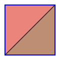
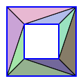
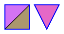
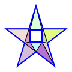
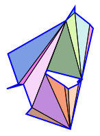

# go-tesselator

[](https://pkg.go.dev/github.com/flywave/go-tesselator)
[](https://goreportcard.com/report/github.com/flywave/go-tesselator)
[](LICENSE)

Go-tesselator is a pure Go implementation of a polygon tesselation library for triangulating complex polygons. It can handle polygons with holes and self-intersecting polygons, making it suitable for graphics processing, GIS, CAD and other applications.

## Features

- Triangulation of complex polygons including those with holes
- Support for both convex and concave polygons
- Efficient sweep line algorithm implementation
- SVG visualization generation for debugging and demonstration
- No external dependencies, only uses Go standard library
- Comprehensive test coverage

## Installation

```bash
go get github.com/flywave/go-tesselator
```

## Usage

### Basic Triangulation

```go
package main

import (
    "fmt"
    "github.com/flywave/go-tesselator"
)

func main() {
    // Define a simple square polygon
    vertices := []tesselator.Vertex{
        {X: 0, Y: 0, Z: 0},
        {X: 100, Y: 0, Z: 0},
        {X: 100, Y: 100, Z: 0},
        {X: 0, Y: 100, Z: 0},
    }
    
    contour := tesselator.Contour(vertices)
    contours := []tesselator.Contour{contour}
    
    // Perform triangulation
    indices, vertices, err := tesselator.Tesselate(contours, tesselator.WindingRuleOdd)
    if err != nil {
        panic(err)
    }
    
    fmt.Printf("Vertices: %v\n", vertices)
    fmt.Printf("Indices: %v\n", indices)
}
```

### Polygon with Holes

```go
// Define outer contour (square)
outerVertices := []tesselator.Vertex{
    {X: 0, Y: 0, Z: 0},
    {X: 100, Y: 0, Z: 0},
    {X: 100, Y: 100, Z: 0},
    {X: 0, Y: 100, Z: 0},
}
outerContour := tesselator.Contour(outerVertices)

// Define inner hole (smaller square)
innerVertices := []tesselator.Vertex{
    {X: 25, Y: 25, Z: 0},
    {X: 75, Y: 25, Z: 0},
    {X: 75, Y: 75, Z: 0},
    {X: 25, Y: 75, Z: 0},
}
innerContour := tesselator.Contour(innerVertices)

contours := []tesselator.Contour{outerContour, innerContour}

// Perform triangulation
indices, vertices, err := tesselator.Tesselate(contours, tesselator.WindingRuleOdd)
```

### Generate SVG Visualization

```go
// Generate SVG visualization of triangulation
err := tesselator.TessellateAndGenerateSVG("example", contours)
if err != nil {
    panic(err)
}
```

## Examples

Here are some examples of triangulation results generated by the library:

### Simple Quad



### Polygon with Hole



### Multiple Contours



### Complex Star Shape



### Random Polygon



## API Reference

### Main Functions

- `Tesselate(contours []Contour, windingRule WindingRule) ([]int, []Vertex, error)` - Main triangulation function
- `TessellateAndGenerateSVG(filename string, contours []Contour) error` - Triangulate and generate SVG visualization
- `GenerateSVG(filename string, contours []Contour, vertices []Vertex, elements []int) error` - Generate SVG from triangulation data

### Data Structures

- `Vertex` - Represents a 3D point with X, Y, Z coordinates
- `Contour` - A slice of vertices defining a polygon contour
- `WindingRule` - Enumeration for different winding rules:
  - `WindingRuleOdd`
  - `WindingRuleNonzero`
  - `WindingRulePositive`
  - `WindingRuleNegative`
  - `WindingRuleAbsGeqTwo`

### Utility Functions

- `GenerateRegularPolygon(sides int, cx, cy, radius float32) Contour` - Generate regular polygon
- `GenerateStar(points int, cx, cy, outerRadius, innerRadius float32) Contour` - Generate star shape
- `GenerateRandomPolygon(points int, cx, cy, radius float32) Contour` - Generate random polygon

## Testing

The library includes comprehensive tests to verify correctness:

```bash
go test -v ./...
```

## Examples

See the test files for various usage examples:
- `simple_test.go` - Basic polygon triangulation examples
- `svg_test.go` - SVG generation examples
- `tess_test.go` - Comprehensive triangulation tests

## License

This project is licensed under the MIT License - see the [LICENSE](LICENSE) file for details.

## Contributing

Contributions are welcome! Please feel free to submit a Pull Request.